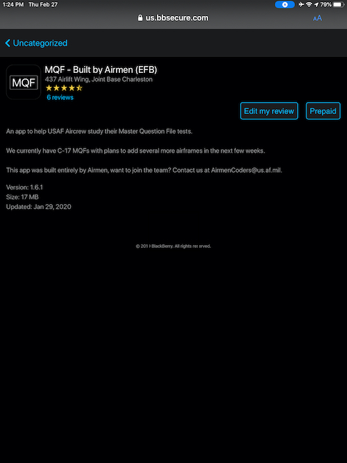
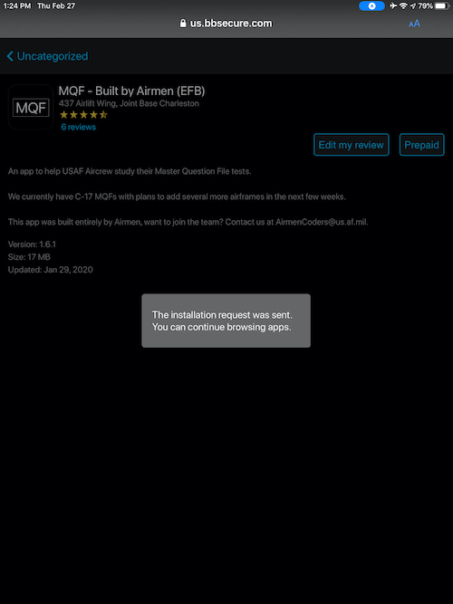

## MQF - Built by Airmen
### Frequently Asked Questions

#### How do I update the app?
Open the BlackBerry Work Apps app and tap into the MQF listing. Then tap "Prepaid." A notice will pop up informing you that the app is installing. 
 

#### I have a better picture for my MWS, how do I add it?
Send us an email at AirmenCoders [at] us.af.mil. Please note that we only accept images that you took (and release the rights to) and images published by DoD Public Affairs via channels like DVIDs.
